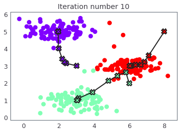

# DIT821 Software Engineering for AI Systems - University of Gothenburg

This repository contains lab assignments done collaboratively with my peers from my undergraduate course on Software Engineering for AI Systems. Each folder below is a separate lab or project, covering foundational and practical topics in Supervised Machine Learning, as well as in Data Preparation and Analysis.

## Lab Folders

- [`Linear Algebra`](Lab1_LinearAlg/)  
  An introductory exercise covering basic linear algebra operations and concepts using Python and NumPy. 

- [`Linear Regression`](Lab2_LinearReg/)  
  Implements linear regression for single and multiple variables, with data visualization and normalization. 

- [`Polynomial Regression`](Lab3_PolyReg/)  
  Explores polynomial regression, bias-variance, regularization, and learning curves. 

- [`Logistic Regression`](Lab4_LogisticReg/)  
  Applies logistic regression for binary classification, including regularization and visualization.
   

- [`k-means Clustering`](Lab5_Kmeans/)  
  Demonstrates k-means clustering and image compression with unsupervised learning.
   

- [`OneVsAll Multi-Class Classification`](Lab6_OneVsAll/)  
  Multi-class classification using one-vs-all logistic regression and neural networks for digit recognition.
   

- [`CNN for Image Classification`](Lab7_CNN/)  
  Introduces convolutional neural networks for image classification. 

- [`Data Handling and Feature Engineering`](Lab9/)  
  Contains exercises on data transformation, feature engineering, and learning to handle invalid data points ahead of training. 

- [`Data Labeling and Annotation`](LabDataMgmt-10/sample.png)  
  Focuses on consistency of annotations for a selected set of traffic images, and computing the IOU from the annotators to measure similarity. 

Each folder contains Jupyter notebooks, data, and scripts relevant to the lab topic. 